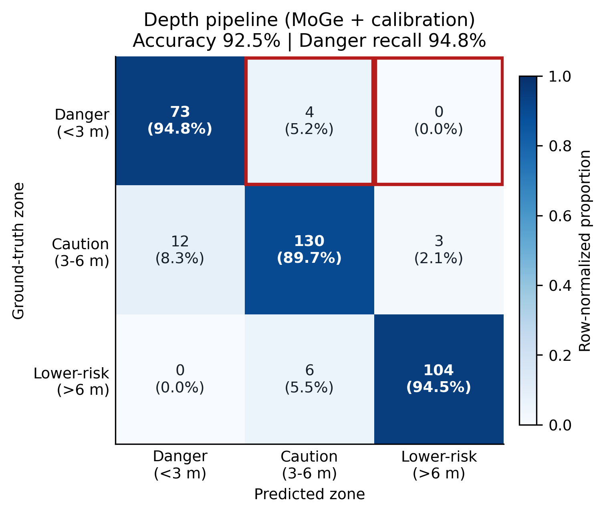
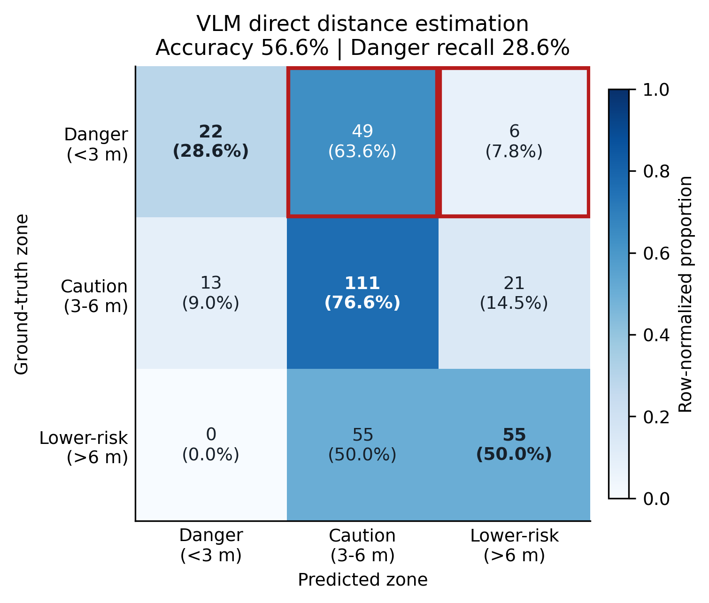
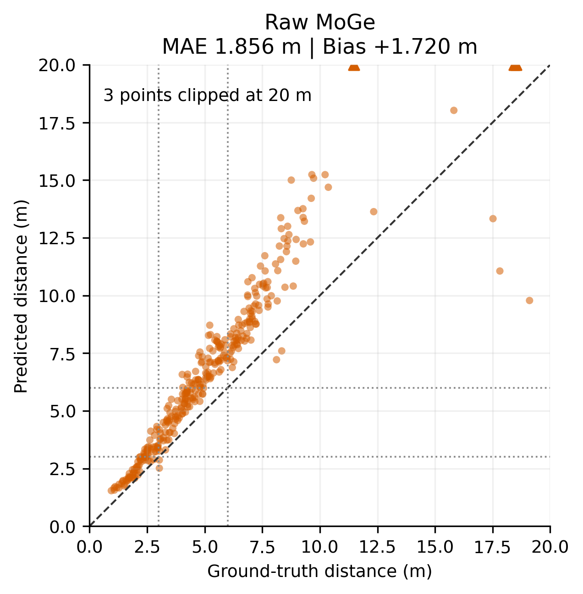
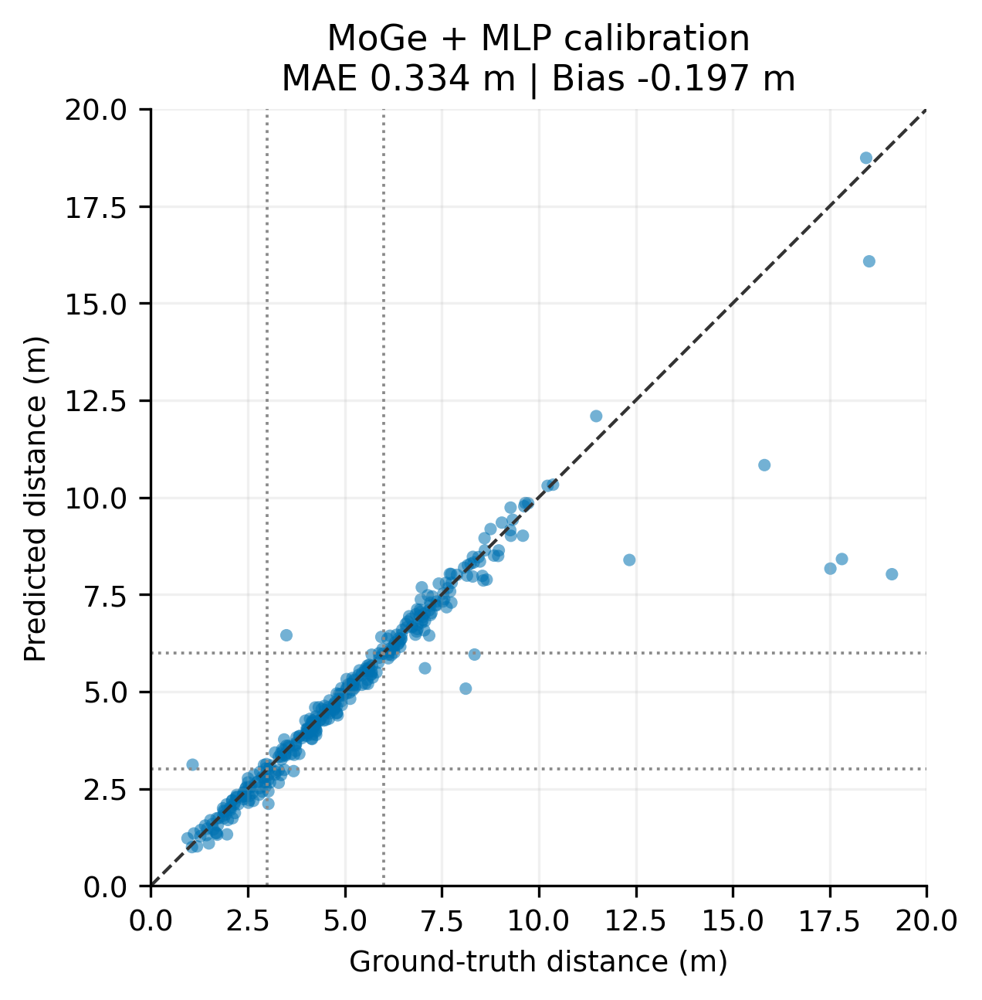
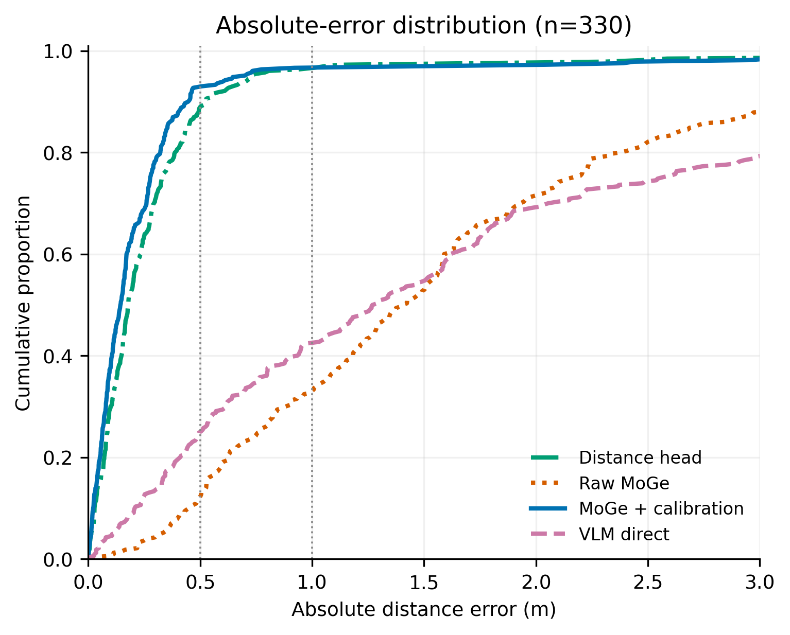
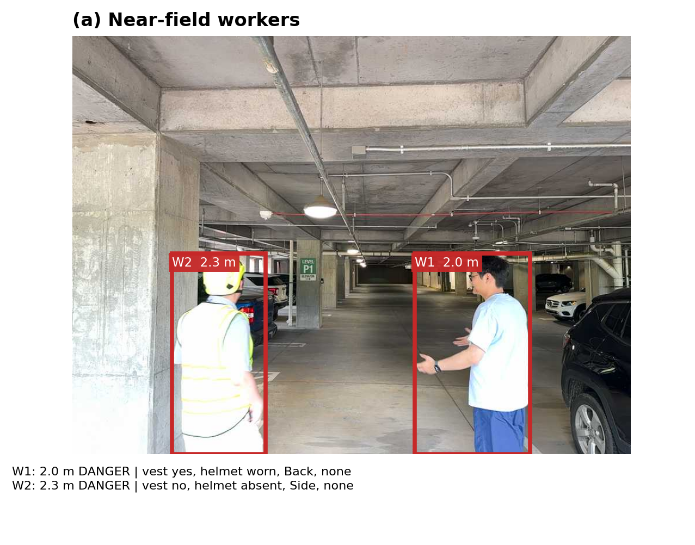
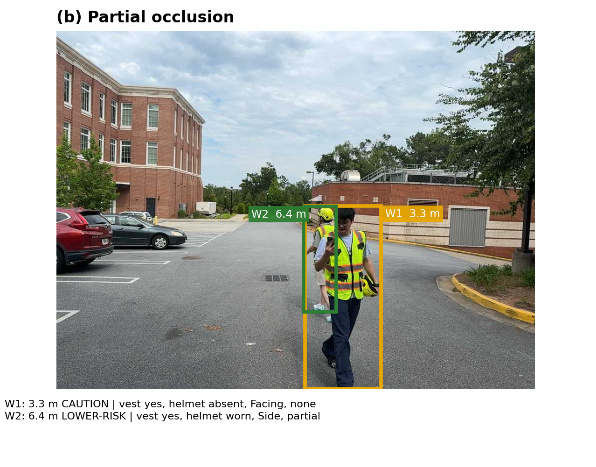
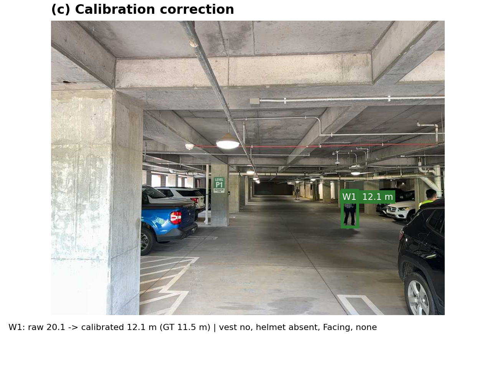
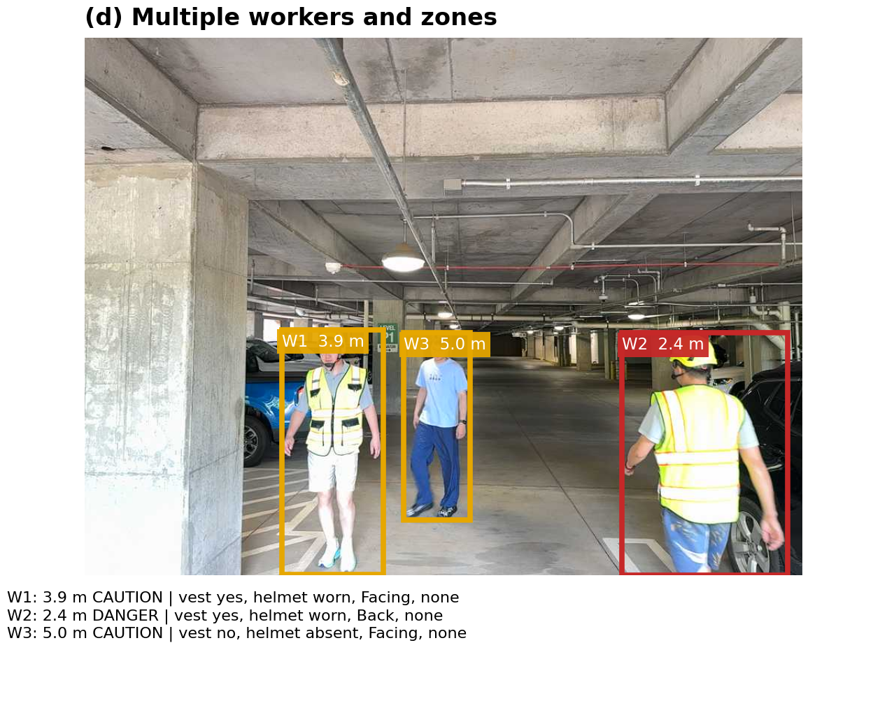
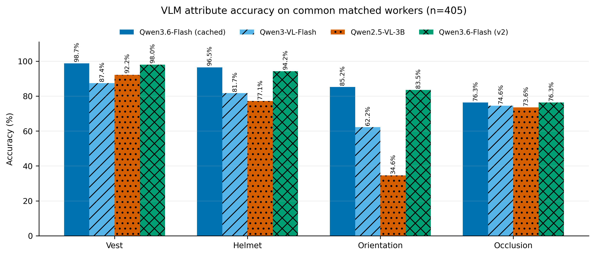

# Work-zone v2 实验产物

本目录对应 `500 + 1185 = 1685` 张 RGB 工地图像的新实验。人体检测和距离 calibration 已重新训练；最终 250 图完整链路使用 `qwen3.6-flash` 重新判断安全属性。

## 目录结构

```text
workzone_v2/
├─ README.md
├─ qwen_prompt.md
├─ data_splits/
│  ├─ workzone_depth.train.csv
│  ├─ workzone_depth.eval.csv
│  └─ workzone_depth.all1685.csv
├─ models/
│  ├─ workzone_yolo11n_person_detector_best.pt
│  ├─ workzone_distance_head_ft_yolo.pt
│  └─ workzone_moge_calibrator.joblib
└─ results/
   ├─ workzone_prepare_summary.json
   ├─ yolo11n_baseline_metrics.json
   ├─ workzone_yolo11n_detector_metrics.json
   ├─ workzone_distance_head_ft_metrics.json
   ├─ scheme1_finetuned_yolo_distance_eval_summary.json
   ├─ workzone_moge_calibrator_metrics.json
   ├─ scheme2_moge_raw_eval_summary.json
   ├─ scheme2_moge_calibrated_eval_summary.json
   ├─ distance_eval_comparison.csv
   ├─ vlm_eval250_comparison.csv
   ├─ qwen3_6_flash_eval250_moge_calibrated_summary.json
   ├─ qwen3_6_flash_eval250_moge_calibrated_per_worker.csv
   └─ qwen3_6_flash_eval250_moge_calibrated_reports/
```

## 数据与切分

| 项目 | 图像 | worker | 有数值距离 GT 的 worker |
|---|---:|---:|---:|
| 全部 | 1685 | 3278 | 3013 |
| Train | 1435 | 2863 | 2674 |
| Validation | 250 | 415 | 339 |

- Wave 1：500 张图，包含 bbox、LiDAR 距离和 VLM 安全属性 GT。
- Wave 2：1185 张图，包含 2472 个 bbox，其中 2356 个有数值 LiDAR 距离；不包含 vest、helmet、orientation、occlusion GT。
- Validation 固定从 Wave 1 六个 recording 中按比例抽取 250 张，随机种子为 `7`。
- Train 使用 Wave 1 剩余 250 张和 Wave 2 全部 1185 张。
- 距离区间统一为 `<3m`、`3-6m`、`>6m`。

## YOLO 人体检测

v2 从官方 `yolo11n.pt` 重新训练，未继承 v1 权重，避免 v1 见过新 validation 图片。训练配置为 30 epoch、`imgsz=960`、batch 8、FP16、冻结前 10 层。

| 模型 | Precision | Recall | mAP50 | mAP50-95 |
|---|---:|---:|---:|---:|
| 官方 YOLO11n baseline | 49.6% | 87.7% | 64.6% | 59.1% |
| v2 fine-tuned YOLO11n | **98.0%** | **96.4%** | **98.1%** | **88.9%** |

## 三种距离方案

`fine-tuned YOLO + distance head` 也使用 v2 新数据重新训练：冻结 v2 YOLO 主干，在 2674 个 train 距离 GT 上训练轻量 head 30 epoch，最佳为第 7 轮。下面三行全部使用同一批 250 图 validation。

| 距离方案 | 成功匹配 / 数值 GT | MAE | RMSE | 0.5m 内 | 1.0m 内 | 档位准确率 |
|---|---:|---:|---:|---:|---:|---:|
| fine-tuned YOLO + distance head | 332 / 339 | 0.371m | 1.145m | 88.9% | 96.4% | **93.1%** |
| fine-tuned YOLO + 原始 MoGe | 332 / 339 | 1.856m | 3.454m | 12.0% | 32.8% | 69.9% |
| fine-tuned YOLO + MoGe + MLP calibration | 332 / 339 | **0.334m** | **1.089m** | **92.8%** | **96.7%** | 92.5% |

Distance head 的推理更轻，不需要运行 MoGe；MoGe + calibration 的 MAE 和 0.5m 内命中率更好。

## MoGe 与 Calibration

MoGe 冻结，不训练模型参数。它对整图生成 metric depth 和相机 FOV；程序在每个 worker 区域汇聚深度，再将 bbox、mask、深度分位数、画面位置、置信度和 FOV 等特征输入小型 calibrator。

Calibrator 只使用 train 的 2672 条成功匹配记录训练，在 train 内按 image_id 留出 20% 比较 scale/bias、linear、ridge、GBR 和 MLP，最终选择 MLP。固定 validation 不参与 calibrator 拟合。

这里的 `332 / 339` 是成功匹配 worker 数 / 有数值距离 GT 的 worker 数，不是图片数。Validation 始终是 250 张图。

## VLM 属性结果

以下前三行从 v1 已完成的 all500 结果中筛选相同 250 图重新计算，API 调用数为 0；最后一行是 v2 重新调用的 `qwen3.6-flash`。为了只比较 VLM 属性能力，表中所有模型统一接 v2 `MoGe + calibration` 距离模块，因此距离 MAE 统一写为 `0.334m`，距离档位统一为 `92.5%`。历史 summary JSON 中的原始距离结果没有修改。

| 方案 | worker 匹配 | 距离 MAE | 距离档位 | Vest | Helmet | Orientation | Occlusion |
|---|---:|---:|---:|---:|---:|---:|---:|
| 历史 qwen3.6-flash（离线筛选） | 407 / 415 | 0.334m | 92.5% | 97.8% | 95.3% | 84.6% | 75.4% |
| 历史 qwen3-vl-flash（离线筛选） | 407 / 415 | 0.334m | 92.5% | 86.6% | 80.9% | 62.0% | 73.6% |
| 历史 Qwen2.5-VL-3B（离线筛选） | 407 / 415 | 0.334m | 92.5% | 91.1% | 76.0% | 34.2% | 72.7% |
| **v2 qwen3.6-flash + MoGe calibration** | **407 / 415** | **0.334m** | **92.5%** | **98.0%** | **94.2%** | **83.5%** | **76.4%** |

VLM 只判断 `high_visibility_vest`、`helmet_status`、`orientation` 和 `occlusion_level`。`distance_to_equipment_m` 来自本地 YOLO + MoGe + calibration，`distance_band` 由代码按米数计算，不让 VLM 猜距离。

## 论文图

下面的图全部由现有 v2 结果离线生成，没有额外调用 VLM API。精确矩阵、样本数和绘图口径见 [`figures/figure_metrics.json`](figures/figure_metrics.json)，生成代码见 [`scripts/plot_workzone_paper_figures.py`](../../scripts/plot_workzone_paper_figures.py)。

### 1. 距离区域混淆矩阵

两种方案严格使用相同的 332 个 worker。红框表示 GT 为 Danger、但被预测为更安全区域的关键漏判。MoGe + calibration 的区域准确率为 92.5%、Danger recall 为 94.8%；VLM 直接估距分别为 56.6% 和 28.6%。

<table>
<tr>
<td></td>
<td></td>
</tr>
</table>

### 2. Calibration 前后与误差分布

左、中的散点图使用全部 332 个距离匹配；右侧 CDF 使用四种方案共同具备结果的 330 个 worker。Raw MoGe 的 MAE 从 1.856m 降至 calibration 后的 0.334m。

<table>
<tr>
<td></td>
<td></td>
<td></td>
</tr>
</table>

### 3. 完整 Pipeline 定性结果

四个案例分别展示近距离 worker、局部遮挡、calibration 修正，以及三名 worker 同时出现的多区域场景。红、黄、绿框分别表示 Danger、Caution 和 Lower-risk。

<table>
<tr>
<td></td>
<td></td>
</tr>
<tr>
<td></td>
<td></td>
</tr>
</table>

### 4. VLM 属性准确率

四个 VLM 结果取共同匹配的 405 个 worker；计算每项属性时排除对应 GT 为 `uncertain` 的 worker。



### 单图文件

以上 README 排版直接引用 [`figures/individual/`](figures/individual/) 中的独立图片，目录中不保留组合图。论文排版建议优先使用单图 PDF，共 10 张：

| 单图 | PNG | PDF |
|---|---|---|
| Depth pipeline 混淆矩阵 | [PNG](figures/individual/fig1a_depth_zone_confusion.png) | [PDF](figures/individual/fig1a_depth_zone_confusion.pdf) |
| VLM 直接估距混淆矩阵 | [PNG](figures/individual/fig1b_vlm_direct_zone_confusion.png) | [PDF](figures/individual/fig1b_vlm_direct_zone_confusion.pdf) |
| Raw MoGe 散点图 | [PNG](figures/individual/fig2a_raw_moge_scatter.png) | [PDF](figures/individual/fig2a_raw_moge_scatter.pdf) |
| Calibration 散点图 | [PNG](figures/individual/fig2b_calibrated_scatter.png) | [PDF](figures/individual/fig2b_calibrated_scatter.pdf) |
| 绝对误差 CDF | [PNG](figures/individual/fig2c_absolute_error_cdf.png) | [PDF](figures/individual/fig2c_absolute_error_cdf.pdf) |
| 近距离案例 | [PNG](figures/individual/fig3a_near_field_workers.png) | [PDF](figures/individual/fig3a_near_field_workers.pdf) |
| 局部遮挡案例 | [PNG](figures/individual/fig3b_partial_occlusion.png) | [PDF](figures/individual/fig3b_partial_occlusion.pdf) |
| Calibration 修正案例 | [PNG](figures/individual/fig3c_calibration_correction.png) | [PDF](figures/individual/fig3c_calibration_correction.pdf) |
| 三人多区域案例 | [PNG](figures/individual/fig3d_multiple_workers_and_zones.png) | [PDF](figures/individual/fig3d_multiple_workers_and_zones.pdf) |
| VLM 属性准确率 | [PNG](figures/individual/fig4_vlm_attribute_accuracy.png) | [PDF](figures/individual/fig4_vlm_attribute_accuracy.pdf) |

## 完整推理流程与字段说明

下面说明当前最终方案。部署时只需要一张 RGB 图，不需要 LiDAR、深度相机或 worker 标签；LiDAR 只在开发和训练阶段用于监督 calibration。

### 总体数据流

```text
单张 RGB 图
  -> fine-tuned YOLO11n 检测每个 worker
  -> 同一张图输入冻结的 MoGe，得到 metric-depth map 和相机内参/FOV
  -> 用 worker 区域在 MoGe 深度图上做逐人采样
  -> 每个 worker 生成固定 22 维几何特征
  -> StandardScaler + MLP calibration 修正距离
  -> 按 3m 和 6m 阈值计算 proximity zone
  -> 带 W1/W2 编号 bbox 的完整图输入 Qwen3.6-Flash
  -> VLM 判断 vest、helmet、orientation、occlusion
  -> 按 worker_index 合并空间和语义结果
  -> 输出一张图对应的结构化 JSON
```

### Full Pipeline：

```text
输入：一张普通 RGB 图片
例如：Garage4_000144.png
图片里可以没有 worker、只有一个 worker，或者同时有多个 worker
          |
          +----------------------------------------------------+
          |                                                    |
          v                                                    v
第一条分支：找人                                      第二条分支：估计整图深度

Fine-tuned YOLO11n                                  MoGe
读取整张 RGB 图                                     读取同一张 RGB 图
          |                                                    |
          v                                                    v
找到图中的所有 worker                                输出整张图的 metric-depth map
每个 worker 得到：                                   深度图中的每个有效像素都有估计米数
  - bbox = [x1, y1, x2, y2]                         同时输出/估计：
  - confidence score                                  - 相机内参 fx, fy, cx, cy
  - worker_index = W1, W2, ...                        - 水平 FOV
          |                                                    |
          | 当前 YOLO11n 是 detect-only                        |
          | 没有真实人体 segmentation mask                     |
          | 所以代码把 bbox 内部当作 bbox-as-mask ROI            |
          |                                                    |
          +------------------------+---------------------------+
                                   |
                                   v
                        对每个 worker 单独处理

以 W1 为例：
YOLO 已经给出了 W1 的 bbox
MoGe 已经给出了整张图的深度图
                                   |
                                   v
把 W1 的 bbox 覆盖到 MoGe 深度图上
只读取 bbox 内对应位置的深度像素
                                   |
                     +-------------+-------------+
                     |                           |
                     v                           v
            Full worker ROI              Lower 60% worker ROI
            bbox 内全部区域               bbox 高度从 40% 到底部
                     |                           |
                     v                           v
       full_values = depth[bbox ROI]  lower_values = depth[bottom 60% ROI]
                     |                           |
                     | 只保留有限且大于 0 的深度值 |
                     v                           v
            计算 5 个分位数              计算 5 个分位数
            depth_p10                    lower_depth_p10
            depth_p25                    lower_depth_p25
            depth_p50                    lower_depth_p50
            depth_p75                    lower_depth_p75
            depth_p90                    lower_depth_p90
                     |                           |
                     +-------------+-------------+
                                   |
                                   v
选择 W1 的代表性前向深度 z_depth_m

下面是二选一：只选择一个中位数，不相加，也不取平均。

如果 Lower 60% ROI 至少有 50 个有效深度像素：
    z_depth_m = lower_values 的中位数
              = lower_depth_p50

否则：
    z_depth_m = full_values 的中位数
              = depth_p50
                                   |
                                   v
使用 bbox-as-mask ROI 的中心像素 (u, v)
以及 MoGe 给出的相机内参 fx, fy, cx, cy
把二维像素回投到三维相机坐标：

    X = (u - cx) * z_depth_m / fx
    Y = (v - cy) * z_depth_m / fy
    Z = z_depth_m
                                   |
                                   v
得到 calibration 前的几何结果：

    raw_distance_m = sqrt(X^2 + Y^2 + Z^2)
    bearing_yaw_deg = degrees(atan2(X, Z))
    elevation_pitch_deg = degrees(atan2(Y, Z))
                                   |
                                   v
为 W1 组装固定的 22 维 calibration 输入

1. 深度相关：12维
   - z_depth_m                                      1维
   - raw_distance_m                                 1维
   - depth_p10/p25/p50/p75/p90                     5维
   - lower_depth_p10/p25/p50/p75/p90               5维

2. YOLO bbox / ROI / detection：7维
   - bbox_width_norm                                 1维
   - bbox_height_norm                                1维
   - bbox_area_norm                                  1维
   - mask_area_norm                                  1维
     当前 detect-only 模型中，它来自 bbox-as-mask 面积
   - center_x_norm                                   1维
   - center_y_norm                                   1维
   - YOLO confidence score                           1维

3. 相机和观察射线：3维
   - bearing_yaw_deg                                 1维
   - elevation_pitch_deg                             1维
   - fov_deg                                         1维

总计：12 + 7 + 3 = 22维
                                   |
                                   v
StandardScaler
使用训练阶段保存的均值和标准差
把22个不同量纲的输入变换到相近尺度
                                   |
                                   v
MLP calibration

    输入层：22维
       -> Linear(22, 32) + ReLU
       -> Linear(32, 16) + ReLU
       -> Linear(16, 1)
    输出：W1 的 calibrated distance
                                   |
                                   v
代码根据 calibrated distance 计算距离档位

    distance < 3m       -> Close / Danger
    3m <= distance <=6m -> Careful / Caution
    distance > 6m       -> Safe / Lower-risk

W2、W3等其他 worker 重复完全相同的逐人距离流程
每个 worker 都得到自己的 bbox、距离、角度和档位

====================================================================

与此同时，语义属性分支处理同一张图：

在原始 RGB 图上给每个 YOLO bbox 画红框
并标记 W1、W2、W3等 worker_index
                                   |
                                   v
把“带编号 bbox 的完整图”交给 Qwen3.6-Flash
Prompt 同时告诉模型：
  - image_id
  - 图中有哪些 worker_index
  - 每个 worker 的 bbox_xyxy

当前 v2 没有额外发送逐 worker crop
也不是每个 worker 单独请求一次 VLM
一个请求可以批量包含多张带编号的完整图
                                   |
                                   v
Qwen3.6-Flash 为图中的每个 worker 返回：

  - high_visibility_vest
      true / false / uncertain

  - helmet_status
      worn / absent / uncertain

  - orientation
      Facing / Side / Back / uncertain

  - occlusion_level
      none / partial / heavy / uncertain

VLM 不负责预测主方案的距离
VLM 也不负责判断 Close / Careful / Safe

====================================================================

结果融合：

空间模块输出：
  W1 -> bbox、calibrated distance、yaw、pitch、distance band
  W2 -> bbox、calibrated distance、yaw、pitch、distance band

语义模块输出：
  W1 -> vest、helmet、orientation、occlusion
  W2 -> vest、helmet、orientation、occlusion
                                   |
                                   v
程序按 worker_index 合并

W1 的空间结果只和 W1 的语义结果合并
W2 的空间结果只和 W2 的语义结果合并
                                   |
                                   v
输出一张图片对应的最终 JSON：

{
  image_id,
  equipment_type,
  worker_count,
  workers: [
    {
      worker_index,
      bbox,
      distance_to_equipment_m,
      distance_band,
      high_visibility_vest,
      helmet_status,
      orientation,
      occlusion_level
    }
  ]
}

如果 YOLO 没检测到 worker：
    worker_count = 0
    workers = []
    程序仍然输出合法 JSON，不会因为空结果崩溃
```

上面描述的是部署推理。LiDAR 只出现在 MLP 的离线训练阶段：

```text
训练图片 -> YOLO + MoGe -> 每个 worker 的 22 维特征
配对 LiDAR depth + GT bbox -> 每个 worker 的真实距离 distance_gt
22 维特征作为输入，distance_gt 作为监督目标
                         |
                         v
训练并保存 StandardScaler + MLP

部署时：
RGB -> YOLO + MoGe -> 22维特征 -> 已保存的 MLP -> calibrated distance
不需要 LiDAR
```

### Stage 1：输入图像

- 输入是一张普通 RGB 图，可以是单人或多人场景。
- Workzone v2 数据集图像为 `960 x 720`，推理代码也支持其他分辨率。
- bbox 宽高、面积和中心位置进入 MLP 前都会除以图像宽高或面积，因此这些特征不依赖固定分辨率。
- 每张图只运行一次 YOLO 和一次 MoGe；MLP 按检测到的 worker 逐人运行。VLM 对每张图判断一次属性，但一个 API 请求可以批量包含多张编号图。

### Stage 2：Fine-tuned YOLO11n worker 检测

YOLO11n 在 Workzone v2 的单类别 worker bbox 上 fine-tune，负责回答“图中有几个人、每个人在哪里”，不负责预测距离和安全属性。

每个检测输出：

| 输出 | 含义 | 后续用途 |
|---|---|---|
| `bbox_xyxy` | worker 检测框 `[x1, y1, x2, y2]` | 深度采样、位置/面积特征、绘制 VLM 编号框 |
| `score` | YOLO 检测置信度 | 作为 calibration 的一个输入特征 |
| `worker_index` | 当前图内从 1 开始的 worker 编号 | 关联距离结果、VLM属性和最终 JSON |

当前 fine-tuned `YOLO11n` 是 detect-only 模型，没有真实实例分割 mask。推理代码在这种情况下将 bbox 内部构造成 `bbox-as-mask` ROI，以便继续做逐人深度采样。因此：

- `mask_source = "bbox"`；
- `mask_area_norm` 实际是 bbox-as-mask 的归一化面积；
- 它与 `bbox_area_norm` 数值接近，不应在论文中描述成真实人体 segmentation mask。

如果以后替换为 `YOLO11n-seg`，同一接口可以直接使用真实实例 mask，不需要修改 MoGe 或 MLP 调用流程，但需要重新生成 calibration 特征并评估是否重新训练 MLP。

### Stage 3A：MoGe metric depth 和相机几何

MoGe 是冻结的预训练单目几何模型，本项目没有 fine-tune MoGe。它对整张 RGB 图输出：

| 输出 | 含义 |
|---|---|
| metric-depth map | 每个有效像素对应的估计深度，单位为米 |
| intrinsics | 估计的 `fx/fy/cx/cy` 相机内参 |
| `fov_deg` | 根据内参计算的水平视场角 |

MoGe 本身不负责识别 worker。YOLO 给出 worker ROI，程序再从 MoGe 深度图中取出每个 worker 对应的深度值。

### Stage 3B：逐 worker 深度采样

对每个 bbox-as-mask ROI，程序同时计算完整 ROI 和下方 60% ROI 的深度统计量：

```text
完整 ROI：depth_p10, depth_p25, depth_p50, depth_p75, depth_p90
下方 60%：lower_depth_p10, lower_depth_p25, lower_depth_p50,
           lower_depth_p75, lower_depth_p90
```

这里的 ROI 是 `Region of Interest`，即“只关注的图像区域”。MoGe 深度图与输入 RGB 图在像素位置上对齐：RGB 图中 `(u, v)` 位置的物体，对应深度图中同一 `(u, v)` 位置的估计米数。因此，程序可以直接用 YOLO bbox 作为索引，从整张 MoGe 深度图里取出属于该 worker 区域的深度。

需要明确以下几点：

1. `Full worker ROI` 是整个 bbox 矩形区域。
2. `Lower 60% worker ROI` 是 bbox 在图像坐标上的下方 60%，不是“深度值最近的 60%”或“最远的 60%”。
3. Lower ROI 是 Full ROI 的子集，两个区域会重叠，不是把 bbox 切成两个互不重叠的样本集合。
4. `full_values` 和 `lower_values` 都不是新图片，而是从深度图中取出并摊平后的一维米数数组。

这里不会把每个 worker crop 统一缩放成 `100 x 100 x 3`。RGB 图确实有 3 个颜色通道，但距离分支采样的是 MoGe 输出的单通道深度图，而且保留 bbox 原本的可变宽高。假设某个 bbox 恰好是 `100 x 100` 像素：

```text
RGB bbox（距离分支不直接使用这些颜色值）：
    shape = 100 x 100 x 3
    每个像素是 [R, G, B]

同位置的 MoGe depth ROI（距离分支实际使用）：
    shape = 100 x 100
    每个像素是一个米数，例如 2.31、2.35、5.80

摊平后：
    full_values 最多包含 100 * 100 = 10,000 个深度米数

下方 60% ROI：
    shape 约为 60 x 100
    lower_values 最多包含 6,000 个深度米数
```

所谓 `p10/p25/p50/p75/p90` 是深度数组的分位数。程序先把有效深度从小到大排序，再读取分布中 10%、25%、50%、75% 和 90% 位置附近的值。例如过滤后有 1,000 个有效深度：

```text
从小到大排序：d[0], d[1], ..., d[999]

p10：大约位于第 100 个位置，表示约 10% 的像素比它更近
p25：大约位于第 250 个位置
p50：大约位于第 500 个位置，也就是中位深度
p75：大约位于第 750 个位置
p90：大约位于第 900 个位置，表示偏远一侧的深度
```

例如某个 worker ROI 的统计结果为：

```text
p10 = 2.20m
p25 = 2.28m
p50 = 2.35m
p75 = 2.48m
p90 = 5.90m
```

这说明大部分像素集中在约 `2.2-2.5m`，但较远一侧出现了接近 `5.9m` 的像素，很可能是 bbox 内混入背景。只给 MLP 一个平均值或中位数会丢失这种信息；五个分位数能用固定 5 个数字概括“主体距离、分布宽度和背景污染”。

例如某个 bbox 的纵向范围为：

```text
y1 = 100
y2 = 300
bbox 高度 = 200 像素

Full ROI 的纵向范围：
    y = 100 到 300

Lower 60% 的起点：
    lower_y = y1 + 0.4 * bbox_height
            = 100 + 0.4 * 200
            = 180

Lower 60% ROI 的纵向范围：
    y = 180 到 300
```

假设 Full ROI 覆盖 20,000 个像素，程序就从 MoGe 深度图对应位置取得最多 20,000 个深度值；Lower ROI 只取其中位于 bbox 下方的子集。概念上相当于：

```text
full_values = depth_map[full_bbox_mask]
lower_values = depth_map[full_bbox_mask AND y >= lower_y]
```

MoGe 可能在反光、纯色、图像边缘或低置信区域产生无效值，因此统计前会过滤：

```text
保留：有限且大于 0 的深度，例如 2.3m、4.8m、7.1m
丢弃：NaN、+Inf、-Inf、0、负数
```

过滤后的两个数组才用于计算 `p10/p25/p50/p75/p90`。这些分位数描述的是深度分布，不是五个固定像素：`p50` 是中位深度，`p10` 偏向较近像素，`p90` 偏向较远像素。

这里只保留有限且大于 0 的深度像素。代表性深度 `z_depth_m` 的选择规则为：

```text
如果下方 60% ROI 至少有 50 个有效深度像素：
    z_depth_m = 下方 60% ROI 的深度中位数
否则：
    z_depth_m = 完整 ROI 的深度中位数
```

下方 60% 通常包含腿部和脚部，受头部形状、上半身遮挡和远处背景混入的影响相对更小。完整 ROI 和下方 ROI 的多个分位数则帮助 MLP 判断深度分布是否分散、是否存在背景污染或异常值。

### Stage 3C：三维回投、原始距离和角度

设 worker ROI 中心像素为 `(u, v)`，代表性深度为 `Z = z_depth_m`，相机内参为 `fx/fy/cx/cy`，程序按针孔相机模型回投：

```text
X = (u - cx) * Z / fx
Y = (v - cy) * Z / fy
Z = z_depth_m

raw_distance_m = sqrt(X^2 + Y^2 + Z^2)
bearing_yaw_deg = degrees(atan2(X, Z))
elevation_pitch_deg = degrees(atan2(Y, Z))
```

字段含义：

| 字段 | 含义 |
|---|---|
| `z_depth_m` | 沿相机前向轴的 worker 深度，不是最终直线距离 |
| `distance_m` | calibration 前相机中心到 worker 的三维直线距离 |
| `bearing_yaw_deg` | worker 相对相机光轴的水平角，左/右方向由符号表示 |
| `elevation_pitch_deg` | worker 相对相机光轴的垂直角 |

### Stage 3D：固定 22 维 calibration 输入

MoGe 深度图和 YOLO bbox 的原始尺寸都不是固定向量。程序先把它们汇总为每个 worker 一条固定的 22 维向量，再输入 MLP：

| 分组 | 特征 | 维数 | 含义 |
|---|---|---:|---|
| 深度 | `z_depth_m` | 1 | 代表性前向深度 |
| 深度 | `distance_m` | 1 | calibration 前的三维直线距离 |
| 深度 | `depth_p10/p25/p50/p75/p90` | 5 | 完整 worker ROI 的深度分位数 |
| 深度 | `lower_depth_p10/p25/p50/p75/p90` | 5 | 下方 60% ROI 的深度分位数 |
| ROI | `bbox_width_norm` | 1 | bbox 宽度 / 图像宽度 |
| ROI | `bbox_height_norm` | 1 | bbox 高度 / 图像高度 |
| ROI | `bbox_area_norm` | 1 | bbox 面积 / 图像面积 |
| ROI | `mask_area_norm` | 1 | 当前 ROI 面积 / 图像面积；detect-only 时来自 bbox-as-mask |
| ROI | `center_x_norm` | 1 | bbox 中心横坐标 / 图像宽度 |
| ROI | `center_y_norm` | 1 | bbox 中心纵坐标 / 图像高度 |
| 检测 | `score` | 1 | YOLO 检测置信度 |
| 相机/射线 | `bearing_yaw_deg` | 1 | 水平观察角 |
| 相机/射线 | `elevation_pitch_deg` | 1 | 垂直观察角 |
| 相机/射线 | `fov_deg` | 1 | MoGe/内参得到的水平 FOV |
| **总计** |  | **22** | 深度 12 + ROI/检测 7 + 相机/射线 3 |

#### bbox 和 ROI 特征如何归一化

这里的 `_norm` 表示“相对于当前输入图片尺寸归一化”，不是与其他 worker 的框比较，也不是除以整个数据集中的最大 bbox。设当前图片宽高为 `W, H`，YOLO bbox 为 `[x1, y1, x2, y2]`：

```text
bbox_width  = max(0, x2 - x1)
bbox_height = max(0, y2 - y1)
bbox_area   = bbox_width * bbox_height
image_area  = W * H
center_x    = (x1 + x2) / 2
center_y    = (y1 + y2) / 2

bbox_width_norm  = bbox_width / W
bbox_height_norm = bbox_height / H
bbox_area_norm   = bbox_area / image_area
mask_area_norm   = ROI 中的像素数 / image_area
center_x_norm    = center_x / W
center_y_norm    = center_y / H
```

例如输入图片为 `960 x 720`，某个 worker bbox 为 `[200, 100, 400, 500]`：

```text
bbox_width_norm  = (400 - 200) / 960 = 0.2083
bbox_height_norm = (500 - 100) / 720 = 0.5556
bbox_area_norm   = (200 * 400) / (960 * 720) = 0.1157
center_x_norm    = 300 / 960 = 0.3125
center_y_norm    = 300 / 720 = 0.4167
```

这些数值表达的是“worker bbox 占当前画面的比例和位置”，因此同一个构图在不同图片分辨率下可以得到相近特征。当前 fine-tuned YOLO11n 是 detect-only，ROI 使用 bbox-as-mask，所以 `mask_area_norm` 通常与 `bbox_area_norm` 非常接近；如果以后使用真实 segmentation mask，两者才会明显不同。

这里有两次不同的尺度处理，不能混为一谈：

```text
第一步：图片尺寸归一化
    bbox_width_norm = bbox像素宽度 / 当前图片像素宽度
    目的：消除输入图片分辨率变化的影响

第二步：StandardScaler
    scaled_feature = (feature - train_mean) / train_std
    目的：让米、角度、置信度和比例等22个不同量纲的特征处于相近数值尺度
```

`StandardScaler` 使用训练集保存下来的每个特征均值 `train_mean` 和标准差 `train_std`；validation 和新图片只能使用这些已保存统计量，不能根据当前 validation 或单张测试图重新计算。

其中 `z_depth_m` 通常接近 `lower_depth_p50`，`distance_m` 也由 `z_depth_m` 和相机射线计算，因此输入中存在一定冗余。当前实验保留这些特征，让小型 MLP 自行学习不同场景下应相信哪个信号。若删除重复特征，需要重新训练并重新报告实验结果。

缺失、非数值或无穷大的特征当前会稳定填为 `0.0`。由于训练时先使用 `StandardScaler`，22个不同量纲的输入会变换到相近尺度后再进入神经网络。

### Stage 3E：MLP calibration 的网络结构

当前 calibration 使用 scikit-learn `StandardScaler + MLPRegressor`：

```text
22维输入
  -> StandardScaler
  -> Linear(22, 32) + ReLU
  -> Linear(32, 16) + ReLU
  -> Linear(16, 1)
  -> calibrated distance
```

单个 MLP 的参数形状为：

```text
weights: (22, 32), (32, 16), (16, 1)
biases:  (32),     (16),     (1)
```

合计 `1,281` 个可训练参数。模型文件中保存了结构相同的 `z_model` 和 `distance_model` 两个 MLP；Workzone v2 的 `z_gt` 与 `distance_gt` 使用同一个 worker LiDAR 深度定义，因此当前两个模型的拟合权重相同。最终 JSON 的距离使用 `distance_model` 输出的 `distance_calibrated_m`。

训练配置：

| 配置 | 值 |
|---|---|
| hidden layers | `(32, 16)` |
| activation | ReLU |
| output activation | Linear / identity |
| optimizer | Adam |
| learning rate | `1e-3` |
| batch size | `64` |
| L2 regularization `alpha` | `1e-3` |
| maximum iterations | `2500` |
| early stopping | 开启 |
| internal validation fraction | `0.2` |
| no-improvement patience | `80` iterations |
| 当前最终模型实际停止 | `221` iterations |

### Calibration 训练数据和 LiDAR 的作用

LiDAR 只用于生成监督目标和选择 calibration 模型，不是部署输入：

```text
训练 RGB -> YOLO + MoGe -> 22维 worker 特征
配对 LiDAR depth + GT bbox -> worker-level distance GT
22维特征 + distance GT -> 训练 calibration regressor
保存 StandardScaler 和 MLP 权重

部署 RGB -> YOLO + MoGe -> 22维特征 -> 已保存 MLP -> 校准距离
```

- Train 中有 `2,674` 个 worker 具备数值 LiDAR 距离 GT。
- 其中 `2,672` 个成功匹配并生成完整 MoGe 特征，进入 calibrator 开发。
- 在 train 内按 `image_id` 留出 20%，比较 scale/bias、linear、ridge、GBR 和 MLP，避免同一图中的 worker 跨入拟合和模型选择两侧。
- MLP 在内部 held-out 上取得最低 distance MAE，因此被选中；选型后再使用全部 `2,672` 条可用训练记录拟合最终模型。
- 固定的 250 图 validation 不参加 YOLO、distance head 或 calibration 的训练和模型选择。

### Stage 3F：距离档位

档位完全由代码根据 calibration 后的米数计算，不由 VLM 判断：

| 数值范围 | 当前 JSON 名称 | 论文名称 |
|---|---|---|
| `distance < 3m` | `Close` | `Danger` |
| `3m <= distance <= 6m` | `Careful` | `Caution` |
| `distance > 6m` | `Safe` | `Lower-risk` |

README 和结果 CSV 中可能同时看到两套名称，但它们的阈值完全相同。论文图优先使用 `Danger / Caution / Lower-risk`，最终产品 JSON 当前使用 `Close / Careful / Safe`。

### Stage 3G：Qwen3.6-Flash 安全属性

VLM 输入包括：

- 一张带 `W1/W2/...` 编号 bbox 的完整图，用于理解全局场景、观察 worker 细节并维持多人对应关系；
- prompt 中列出的 `image_id`、每个 `worker_index` 和对应 `bbox_xyxy`；
- 固定 prompt 和固定 JSON schema，见 [`qwen_prompt.md`](qwen_prompt.md)。

当前 v2 实验没有额外发送逐 worker crop，也不是“每个 worker 单独请求一次 VLM”。一个请求可以批量包含多张编号完整图，模型需要为每张图中的所有 worker 一次性返回属性。若以后加入高分辨率 crop，应作为新的 VLM 输入方案单独评估，不能直接与当前结果混用。

VLM 只输出四类视觉属性：

| 字段 | 允许值 | 含义 |
|---|---|---|
| `high_visibility_vest` | `true / false / uncertain` | 是否明确穿着高可视性背心或外套 |
| `helmet_status` | `worn / absent / uncertain` | 是否明确佩戴安全帽 |
| `orientation` | `Facing / Side / Back / uncertain` | 上半身相对相机的朝向 |
| `occlusion_level` | `none / partial / heavy / uncertain` | worker 被遮挡或被画面边缘截断的程度 |

VLM 不预测最终距离和距离档位。主方案中的 `distance_to_equipment_m` 来自本地 MoGe + MLP calibration，避免把语言模型不稳定的目测距离混入空间模块。

### Stage 4：逐 worker 结果融合

空间模块和语义模块都按 `worker_index` 关联。最终每张图输出一个 JSON，多个 worker 就产生多条 `workers[]` 记录：

```json
{
  "image_id": "Garage4_000144.png",
  "equipment_type": "dump truck",
  "worker_count": 2,
  "workers": [
    {
      "worker_index": 1,
      "distance_to_equipment_m": 2.02,
      "distance_band": "Close",
      "high_visibility_vest": true,
      "helmet_status": "worn",
      "orientation": "Back",
      "occlusion_level": "none"
    }
  ]
}
```

这里的距离严格来说是“相机中心到 worker 代表位置的距离”。由于相机模拟安装在设备上，项目将其作为 `distance_to_equipment_m` 的近似。若真实部署中相机与设备参考点相距较远，需要增加相机到设备坐标系的外参变换。

### Stage 5：下游使用

最终 JSON 可以提供给规则系统、告警界面或风险报告模块，例如：

```text
是否进入 Danger 区域？
是否未佩戴安全帽或高可视性背心？
worker 是否背对设备？
worker 是否严重遮挡？
是否需要提高告警等级？
```

当前仓库完成的是感知和结构化记录，Stage 5 的具体告警策略尚未训练，也不计入当前实验指标。

最终 250 份 validation JSON 位于 [`results/qwen3_6_flash_eval250_moge_calibrated_reports/`](results/qwen3_6_flash_eval250_moge_calibrated_reports/)。

## 复现命令

准备数据：

```powershell
D:\coding\anaconda\envs\qwen\python.exe -m human_detect.prepare_workzone_v2
```

训练 YOLO：

```powershell
D:\coding\anaconda\envs\qwen\python.exe -m human_detect.train_yolo `
  --data data\workzone_v2_yolo_person\workzone_person.yaml `
  --model yolo11n.pt --epochs 30 --imgsz 960 --batch 8 `
  --device cuda:0 --freeze 10 --patience 8 --amp
```

调用 VLM 前只在本地环境设置 `QWEN_API_KEY`，不要把真实 Key 写入 README、代码或 Git。
